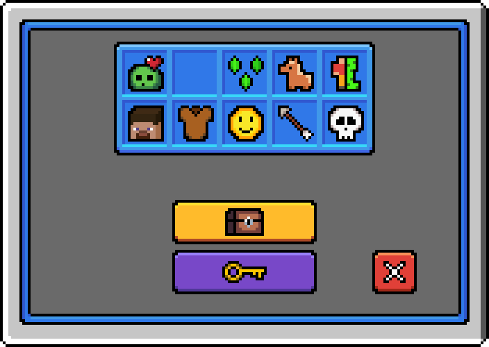
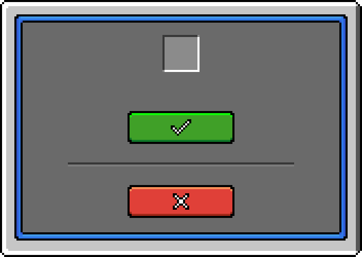

# uc-gui

GUI resource pack for the Minecraft plugin [UltraCosmetics](https://www.spigotmc.org/resources/10905/).

- Aseprite source files are in `/aseprite/`.
- Resource pack/GUI textures are in `/resourcepack/`.

---

## 🖼️ Preview

### Main menu



### Buy menu (keys, cosmetics etc.)



## 🛠️ How to use

### Add server resource pack

Edit the `server.properties` file:

```properties
resource-pack=https://github.com/dennishzg/uc-gui/releases/download/v1.1.0/UC-GUI-v1.1.0.zip
```

### Create menu

Example menu using DeluxeMenus.

#### GUI texture

- 🏠 = Main menu texture
- 🪙 = Buy menu texture

```yaml
size: 54
menu_title: "&f🎲🎲🎲🎲🎲🎲🎲🎲🏠"
```

#### Invisible items

Invisible items are necessary to make the buttons/icons in the GUI clickable. Create an invisible item with:

```yaml
items:
  'invisibleitem':
    material: MAP
    model_data: 1010
    slot: 23
    display_name: "&aInvisible item"
```

#### Custom items

##### Key

```yaml
items:
  'key':
    material: QUARTZ
    model_data: 1
    slot: 23
    display_name: "&aKey"
```
