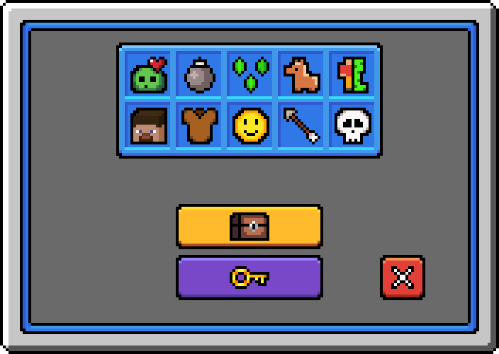

# uc-gui

GUI resource pack for the Minecraft plugin [UltraCosmetics](https://www.spigotmc.org/resources/10905/).

- Aseprite source files are in `/aseprite/`.
- Resource pack and GUI textures are in `/resourcepack/`.

---

## 🧩 Official Addon

> [!TIP]
> You can use the official addon plugin if your server doesn't have a resource pack. Simply put the .jar in the plugins folder and you're done.
> Download the plugin from one of these links:
>
> - [SpigotMC](https://www.spigotmc.org/resources/ultracosmetics-gui-addon.117279/)
> - [GitHub](https://github.com/UltraCosmetics/UltraCosmetics-gui-addon)

## 🖼️ Preview

### Main menu



### Buy menu (keys, cosmetics etc.)


## 🛠️ How to use

### Add server resource pack

Edit the `server.properties` file:

```properties
resource-pack=https://github.com/dennishzg/uc-gui/releases/download/v2.0.0/UC-GUI-v2.0.0.zip
```

### Create menu

Example menu using DeluxeMenus.

#### GUI texture

- 🏠 = Main menu texture
- 🪙 = Buy menu texture

```yaml
size: 54
menu_title: "&f🎲🎲🎲🎲🎲🎲🎲🎲🏠"
```

#### Custom items

Example:

```text
/minecraft:give @p minecraft:brick[minecraft:item_model="ucgui:uc_items/key"]
```

| Image                         | Item model                 | Description |
| ----------------------------- | -------------------------- | ----------- |
| invisible                     | `ucgui:guis/invisibleitem` | Invisible items are necessary to make the buttons/icons in the GUI clickable. |
| ![Key][p-key]                 | `ucgui:uc_items/key`       | Treasure chest key |

[p-key]: .github/readme-assets/preview-key.png
